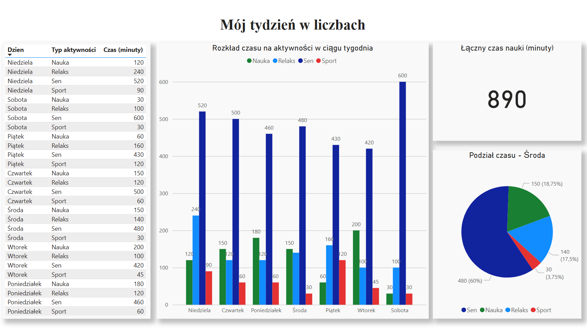

# 📊 Power BI – Aktywność tygodniowa

## 🔍 Opis
Dashboard Power BI analizujący czas spędzany na czterech typach aktywności: Nauka, Sen, Relaks i Sport. Dane są przykładowe i przedstawiają tydzień z życia użytkownika. Projekt został wykonany w celach edukacyjnych i stanowi część mojego portfolio.

## 📈 Co zawiera:
- Wykres kolumnowy z podziałem aktywności na dni tygodnia
- Wykres kołowy prezentujący strukturę aktywności w wybranym dniu (Środa)
- Kartę z łącznym czasem nauki
- Tabelę z danymi surowymi
- Estetyczne formatowanie (cienie, kolory, marginesy)
- Sortowanie dni tygodnia w naturalnej kolejności

## 🛠 Technologie
- Power BI Desktop
- Power Query (czyszczenie danych)
- Custom sortowanie (numerowanie dni tygodnia)
- Git + GitHub (zarządzanie wersjami)

## 📎 Pliki
- `aktywnosc_dashboard.pbix` – plik projektu Power BI
- `aktywnosc.csv` – dane źródłowe w formacie CSV (UTF-8)
- `dashboard_preview.png` – zrzut ekranu finalnego dashboardu
- `README.md` – ten opis

## 🧭 Jak otworzyć projekt

1. Pobierz pliki z repozytorium
2. Otwórz Power BI Desktop
3. Kliknij „Plik” → „Otwórz” → wybierz `aktywnosc_dashboard.pbix`
4. W razie potrzeby zaktualizuj ścieżkę do pliku CSV (`aktywnosc.csv`) w Power Query

## 👨‍💻 Autor
Michał Gągorowski
📍 Sosnowiec, Polska  
🎓 Student informatyki

---

#PowerBI #Dashboard #DataVisualization #GitHubPortfolio #Mychal5on